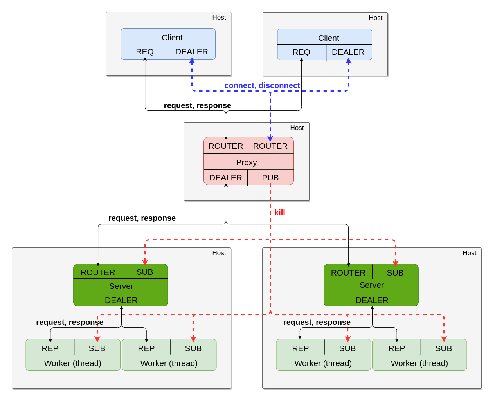

# opentelemetry-c-demo

Simple ZeroMQ client, proxy and server application traced using [opentelemetry-c](https://github.com/augustinsangam/opentelemetry-c). Clients ask servers to compute the nth prime number (n is the request input). Requests and responses are routed through a central proxy.

## Architecture

The picture below shows how hosts are connected through ZeroMQ sockets. Arrows represent how messages flow.



### The proxy

The proxy binds 4 sockets on ports 5559, 5560, 5561 and 5562. Make sure those ports are available before running applications.

- A pair of ROUTER and DEALER sockets to exchange messages (requests and responses) between frontend and backends. Read more on this combination in the [ZMQ Guide](https://zguide.zeromq.org/docs/chapter2/#Shared-Queue-DEALER-and-ROUTER-sockets).
- A ROUTER socket receiving clients' connection and disconnection messages. These sockets help track the number of clients connected. When a client connects to the proxy, it sends a message saying "CONNECT". And "DISCONNECT" when he is done.
- A PUB socket sends a message ("KILL") whenever the proxy wants to shut down. This helps all subscribers to gracefully exit.

### Client

In the previous picture, 2 host clients are shown. This number could be infinite. Each client connects to two sockets:

- A REQ socket is connected to one of the proxy ROUTER socket to send requests and receive responses.
- A DEALER socket connected to the other proxy ROUTER socket to send client "CONNECT" and "DISCONNECT" messages.

### Server

In the previous picture, 2 host clients are shown. Each host has 2 workers threads. These numbers could be infinite too.

Each server connects/binds to three sockets:

- A ROUTER socket is connected to the Proxy DEALER socket, to send requests and receive responses from workers.
- A SUB socket is connected to the Proxy PUB socket to be notified when the proxy stops.
- A DEALER socket is binded with Workers, to forward requests/replies to workers.

### Worker

The worker is the one in charge of handling the client's requests.

Each worker connects to two sockets:

- A REP socket to connect to the Server DEALER socket, to receive requests and send responses to the server.
- A SUB socket is connected to the Proxy PUB socket to be notified when the proxy stops.

## Run

```console
$ git clone --recurse-submodules https://github.com/augustinsangam/opentelemetry-c-demo.git
$ cd opentelemetry-c-demo
$ docker compose up
```

This command will launch 3 clients, 1 proxy and 2 servers on different hosts. Each client will send 10 requests to the server and shut down. After all clients shutdowns, the proxy will shut down and finally the server also.

Each host logs and traces are mounted to the `out/` directory. Here will be the folder structure :

```plaintext
.
└── out/
    ├── ctf-traces/
    │   ├── client1/
    │   │   └── ... (ctf traces)
    │   ├── client2/
    │   │   └── ... (ctf traces)
    │   ├── client3/
    │   │   └── ... (ctf traces)
    │   ├── proxy/
    │   │   └── ... (ctf traces)
    │   ├── server1/
    │   │   └── ... (ctf traces)
    │   └── server2/
    │       └── ... (ctf traces)
    └── output/
        ├── client1/
        │   └── output.log
        ├── client2/
        │   └── output.log
        ├── client3/
        │   └── output.log
        ├── proxy/
        │   └── output.log
        ├── server1/
        │   └── output.log
        └── server2/
            └── output.log
```

Example of client output :

```plaintext
Script started on 2022-12-25 22:30:51+00:00 [<not executed on terminal>]
[client] Connecting to the proxy
[client] Requesting nth_prime_buffer=1
[client] Received 1th prime = 2
[client] Requesting nth_prime_buffer=1001
[client] Received 1001th prime = 7927
[client] Requesting nth_prime_buffer=2001
[client] Received 2001th prime = 17393
[client] Requesting nth_prime_buffer=3001
[client] Received 3001th prime = 27457
[client] Requesting nth_prime_buffer=4001
[client] Received 4001th prime = 37831
[client] Requesting nth_prime_buffer=5001
[client] Received 5001th prime = 48619
[client] Requesting nth_prime_buffer=6001
[client] Received 6001th prime = 59369
[client] Requesting nth_prime_buffer=7001
[client] Received 7001th prime = 70663
[client] Requesting nth_prime_buffer=8001
[client] Received 8001th prime = 81817
[client] Requesting nth_prime_buffer=9001
[client] Received 9001th prime = 93187

Script done on 2022-12-25 22:30:53+00:00 [COMMAND_EXIT_CODE="0"]
```

Example of proxy output :

```plaintext
Script started on 2022-12-25 22:30:51+00:00 [<not executed on terminal>]
[proxy ] Starting proxy...
[proxy ] Binding proxy to connector...
[proxy ] Binding proxy to terminator...
[proxy ] Binding proxy to frontend...
[proxy ] Binding proxy to backend...

Script done on 2022-12-25 22:30:53+00:00 [COMMAND_EXIT_CODE="0"]
```

Example of server output :

```plaintext
Script started on 2022-12-25 22:30:51+00:00 [<not executed on terminal>]
[server] Connecting to the terminator...
[server] Connecting to the proxy...
[server] Connecting to the terminator...
[server] Connecting to the terminator...
[server] Connecting to the terminator...
[server] Connecting to the terminator...
[server] Connecting client to workers...
[server] Connecting to the terminator...
[server] Connecting to the terminator...
[server] Connecting to the terminator...
[server] Connecting to the terminator...
[server] Received nth=1
[server] Replied 1th prime = 2
[server] Received nth=1
[server] Replied 1th prime = 2
[server] Received nth=1001
[server] Received nth=1001
[server] Replied 1001th prime = 7927
[server] Replied 1001th prime = 7927
[server] Received nth=2001
[server] Received nth=2001
[server] Received nth=1
[server] Replied 1th prime = 2
[server] Received nth=1001
[server] Replied 1001th prime = 7927
[server] Received nth=2001
[server] Replied 2001th prime = 17393
[server] Replied 2001th prime = 17393
[server] Received nth=3001
[server] Received nth=3001
[server] Replied 2001th prime = 17393
[server] Received nth=3001
[server] Replied 3001th prime = 27457
[server] Replied 3001th prime = 27457
[server] Received nth=4001
[server] Replied 3001th prime = 27457
[server] Replied 4001th prime = 37831
[server] Received nth=5001
[server] Received nth=5001
[server] Replied 5001th prime = 48619
[server] Received nth=6001
[server] Replied 5001th prime = 48619
[server] Replied 6001th prime = 59369
[server] Received nth=7001
[server] Received nth=7001
[server] Replied 7001th prime = 70663
[server] Received nth=8001
[server] Replied 7001th prime = 70663
[server] Received nth=9001
[server] Replied 8001th prime = 81817
[server] Received nth=9001
[server] Replied 9001th prime = 93187
[server] Replied 9001th prime = 93187
[server] Received kill signal

Script done on 2022-12-25 22:30:53+00:00 [COMMAND_EXIT_CODE="0"]
```

To view and analyze CTF traces, you can use the [otel-replayer project](https://github.com/augustinsangam/otel-replayer) to send each host's telemetry data to observability backends like Jaeger and Prometheus.
